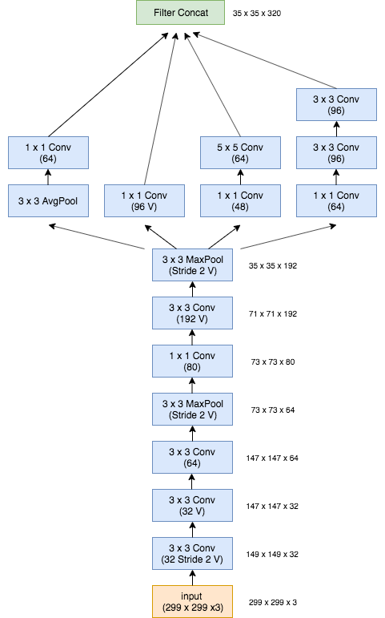
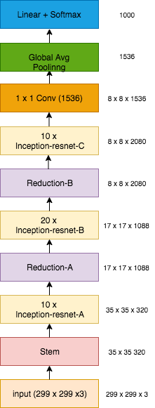

## Introduction
An inofficial PyTorch implementation of [Inception-v4, Inception-ResNet and
the Impact of Residual Connections on Learning](https://arxiv.org/abs/1602.07261)

## Models
+ Inception-v4
+ Inception-ResNet-v2

## Analysis
All the results reported here are based on **this repo**, and 50000 ImageNet **validation** sets。

- [X] top-1 accuracy
- [X] top-5 accuracy
- [X] \# model parameters / FLOPs
- [X] inference time (average)
- [X] bottom10 accuracy
- [X] Hyper parameters
- [ ] blacklists

+ Top-1 and top-5 accuracy **with** blacklisted entities

    |   Model  | top-1([TF](https://github.com/tensorflow/models/tree/master/research/slim)) | top-1(this repo) | top-5([TF](https://github.com/tensorflow/models/tree/master/research/slim)) | top-5(this repo) |
    | :------: | :------: | :------: | :------: | :------: |
    | Inception-v4 | 0.801 | 0.801 | 0.952 | 0.950 |
    | Inception-ResNet-v2 | 0.804 | 0.803  | 0.953 | 0.951 |

+ Other hyper-parameters in **Inception-v4**

    `eps` in **BatchNorm2d** and `count_include_pad` in **AvgPool2d**

    |  Config | #top-1 | top-1 | #top-5 | top-5 |
    | :------: | :------: | :------: | :------: | :------: |
    | eps=0.001, count_include_pad=False | 40041 | 0.801 | 47445 | 0.949 |
    | eps=0.001, count_include_pad=True | 39970 | 0.799 | 47395 | 0.948 |
    | eps=1e-5, count_include_pad=False | 40036 | 0.801 | 47438 | 0.949 |

+ Model parameters and FLOPs

    |   Model  | Params(M) | FLOPs(G) |
    | :------: | :------: | :------: |
    | Inception-v4 | 42.68 | 6.31 | 
    | Inception-ResNet-v2 | 55.84  | 6.65 |

+ Average inference time(RTX 2080Ti)

    |   Model  | Single inference time(ms) | 
    | :------: | :------: |
    | Inception-v4 | 40.54 | 
    | Inception-ResNet-v2 | 61.62 | 

+ Top-1 and top-5 accuracy(bottom-10 classes)

    + Inception-v4

        | Top-1 accuracy | Classes | Top-5 accuracy | Classes |
        | :------: | :------: | :------: | :------: |
        | 0.16 | n04152593 : screen, CRT screen | 0.62 | n03692522 : loupe, jeweler's loupe |
        | 0.22 | n04286575 : spotlight, spot | 0.64 | n04286575 : spotlight, spot |
        | 0.22 | n02123159 : tiger cat | 0.64 | n04525038 : velvet |
        | 0.22 | n03642806 : laptop, laptop computer | 0.68 | n04081281 : restaurant, eating house, eating place, eatery |
        | 0.22 | n04355933 : sunglass | 0.72 | n03532672 : hook, claw |
        | 0.24 | n04560804 : water jug | 0.72 | n03658185 : letter opener, paper knife, paperknife |
        | 0.26 | n04525038 : velvet | 0.74 | n03476684 : hair slide |
        | 0.26 | n02979186 : cassette player | 0.74 | n02910353 : buckle |
        | 0.28 | n02107908 : Appenzeller | 0.76 | n02776631 : bakery, bakeshop, bakehouse |
        | 0.34 | n03710637 : maillot | 0.76 | n03347037 : fire screen, fireguard |
    
    + Inception-ResNet-v2
    
        | Top-1 accuracy | Classes | Top-5 accuracy | Classes |
        | :------: | :------: | :------: | :------: |
        | 0.18 | n04152593 : screen, CRT screen | 0.6 | n04286575 : spotlight, spot |
        | 0.22 | n03710637 : maillot | 0.64 | n04525038 : velvet |
        | 0.22 | n02123159 : tiger cat | 0.64 | n03692522 : loupe, jeweler's loupe |
        | 0.28 | n02979186 : cassette player | 0.66 | n03658185 : letter opener, paper knife, paperknife |
        | 0.28 | n04008634 : projectile, missile | 0.7 | n04081281 : restaurant, eating house, eating place, eatery |
        | 0.28 | n04355933 : sunglass | 0.72 | n03532672 : hook, claw |
        | 0.3 | n03658185 : letter opener, paper knife, paperknife | 0.74 | n04591157 : Windsor tie |
        | 0.3 | n03642806 : laptop, laptop computer | 0.74 | n03016953 : chiffonier, commode |
        | 0.3| n04286575 : spotlight, spot | 0.74 | n04239074 : sliding door |
        | 0.32| n02089973 : English foxhound | 0.74 | n03476684 : hair slide |
        
## Inception-Resnet-v2 Architecture  

+ Stem

    
    
 + Overall schema
 
        
    
    **The output of the last Inception-ResNet-C layer has no ReLU activation.**

## Reference
+ [https://github.com/tensorflow/models/tree/master/research/slim/nets](https://github.com/tensorflow/models/tree/master/research/slim/nets)
+ [https://github.com/tensorflow/models/tree/master/research/inception/inception/data](https://github.com/tensorflow/models/tree/master/research/inception/inception/data)
+ [https://github.com/Cadene/pretrained-models.pytorch](https://github.com/Cadene/pretrained-models.pytorch)
+ [https://github.com/kentsommer/keras-inceptionV4](https://github.com/kentsommer/keras-inceptionV4)
+ [https://github.com/Lyken17/pytorch-OpCounter](https://github.com/Lyken17/pytorch-OpCounter)